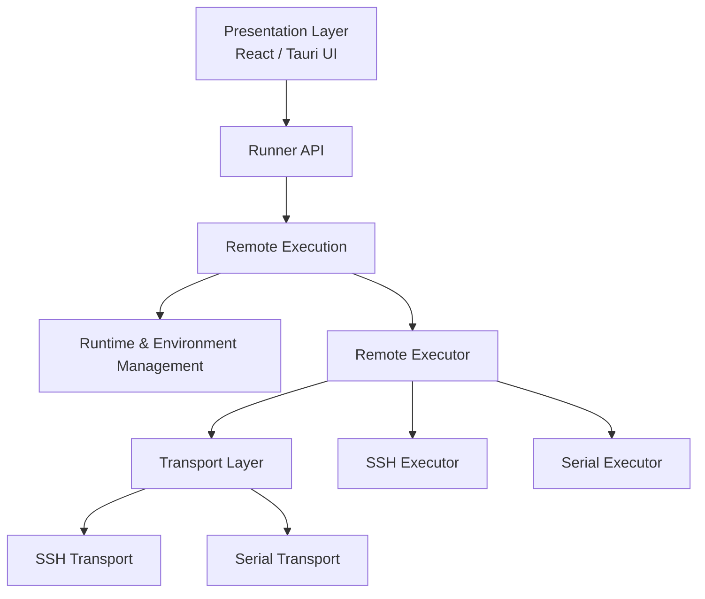
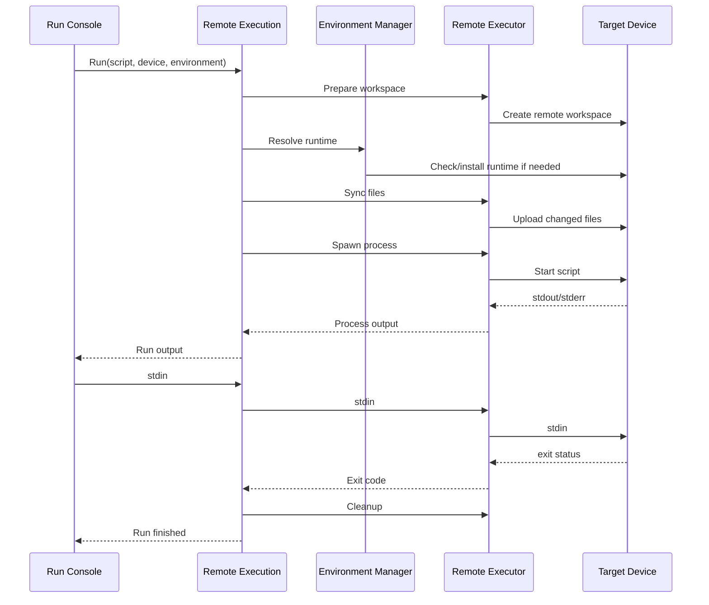
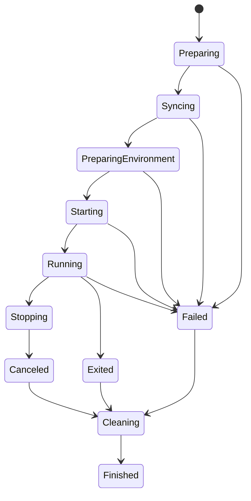
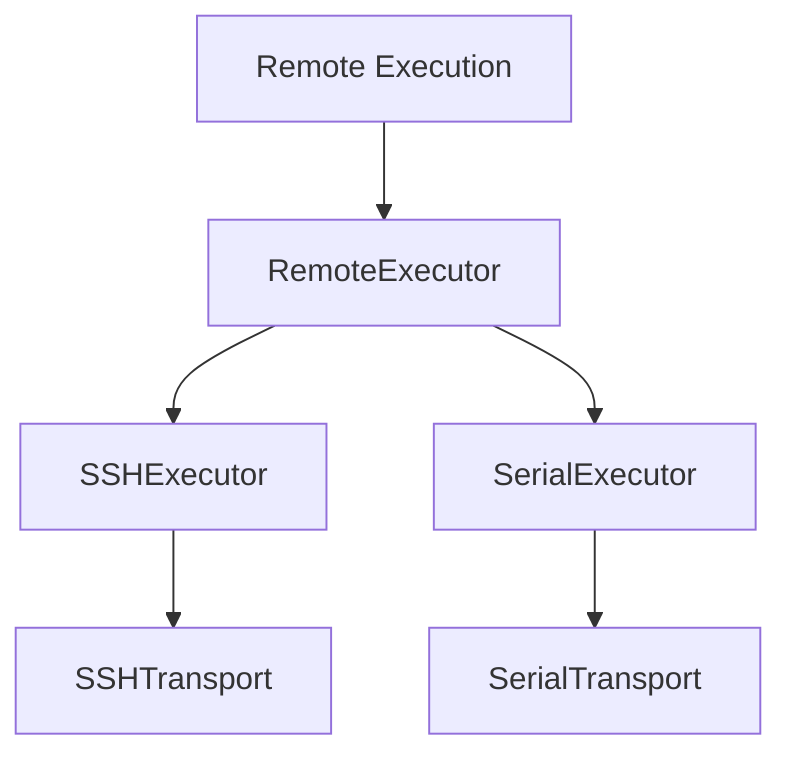
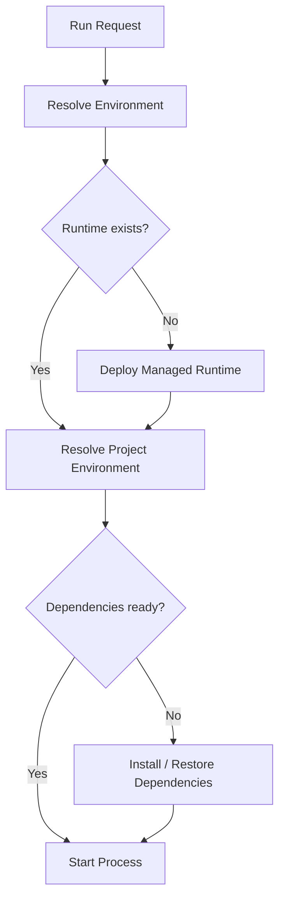
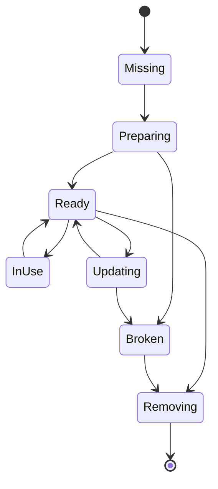
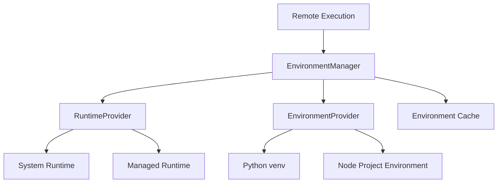
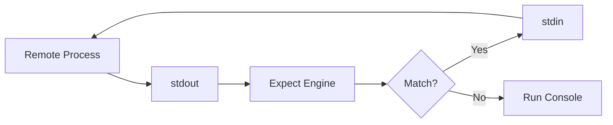
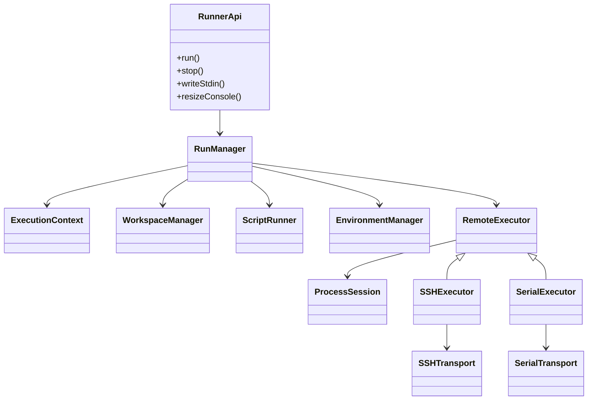
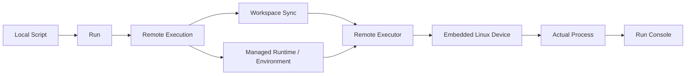

# Embedded Linux Remote Script Runner
## 基于 Tauri 的远程脚本执行与环境管理工具设计文档

> 目标：让用户像“在本地运行脚本”一样，在远程嵌入式 Linux 设备上执行 Shell、Python、Node.js 等脚本，同时屏蔽 SSH/串口终端、远程路径、PTY、SFTP 等底层细节，并提供独立运行环境、交互式输入输出、文件同步、任务状态与执行历史。

---

## 1. 项目背景

嵌入式 Linux 应用开发过程中，经常存在以下工作流：

- 编写 Shell / Python / Node.js 脚本；
- 将脚本上传到目标设备；
- 通过 SSH 或串口登录目标设备；
- 设置环境变量；
- 进入指定目录；
- 激活 Python / Node 环境；
- 运行脚本；
- 与脚本进行交互；
- 查看 stdout / stderr；
- 复制日志；
- 下载脚本生成的结果文件；
- 清理临时目录。

传统工具通常把这些行为拆散到多个程序中：

- SSH Terminal；
- 串口 Terminal；
- SCP / SFTP；
- 编辑器；
- Python 虚拟环境；
- Node.js 版本管理；
- 日志查看器。

本项目希望将它们统一成一个“远程脚本运行器”。

用户面对的核心概念不是：

> “我要登录远程设备。”

而是：

> “我要在某个目标设备上运行这个本地脚本。”

---

# 2. 产品定位

建议产品定位为：

**Embedded Linux Remote Script Runner**

或者：

**Remote Embedded Runner**

核心体验：

```text
选择本地脚本
    ↓
选择目标设备
    ↓
选择运行环境
    ↓
点击 Run
    ↓
在 Run Console 中与程序交互
    ↓
查看结果
```

用户无需感知：

- SSH shell；
- root prompt；
- `/tmp/...` 临时目录；
- SFTP；
- PTY；
- 串口 shell prompt；
- heredoc；
- marker；
- runtime 解压路径；
- Python venv 激活命令。

这些都属于系统内部实现。

---

# 3. 核心设计原则

## 3.1 屏蔽远程 Terminal

GUI 不提供“SSH Terminal”作为主要交互入口。

用户看到的是：

- Script Editor；
- Run Console；
- Task / Run History；
- Device Selector；
- Runtime / Environment Selector。

例如：

```text
▶ test_audio.py

Initializing audio subsystem...
HDMI RX detected.

Please select input:
1. HDMI0
2. HDMI1

> _
```

而不是：

```text
root@rk3588:/tmp/devrunner/45a4c2# python3 test_audio.py
```

---

## 3.2 Run Console 绑定的是“远程进程”，不是“远程 Shell”

Run Console 的语义：

> 当前正在运行的脚本或程序的 stdin/stdout/stderr。

而不是：

> SSH 登录之后的交互式 Shell。

因此一次运行对应一个明确的 `ProcessSession`。

---

## 3.3 Remote Execution 隐藏底层传输差异

上层使用统一接口：

```text
run
writeStdin
stop
resizeConsole
downloadArtifact
```

底层可以是：

- SSH；
- Serial；
- 后续的 Device Agent；
- ADB；
- USB；
- WebSocket；
- 其他自定义协议。

---

## 3.4 环境是执行任务的一等公民

脚本不能默认依赖目标系统的全局：

```text
/usr/bin/python3
/usr/bin/node
/usr/lib/python...
```

每个 Workspace / Script Task 可以绑定自己的运行环境。

例如：

```text
audio-test
  └── Python 3.12 Runtime
      └── venv
          ├── numpy
          ├── requests
          └── pyyaml
```

或者：

```text
web-test
  └── Node.js 22 Runtime
      └── node_modules
```

---

# 4. 技术栈

推荐：

## Frontend

- Tauri 2
- React
- TypeScript
- xterm.js
- Monaco Editor
- Zustand

## Backend

- Rust
- Tokio
- serde
- tracing
- uuid
- russh 或 ssh2
- tokio-serial
- SQLite

建议优先考虑：

```text
Tauri 2
React + TypeScript
xterm.js
Monaco Editor

Rust
Tokio
russh
tokio-serial
serde
tracing
SQLite
```

---

# 5. 总体架构



---

# 6. 分层设计

整体分为六个主要层次：

```text
Presentation
    ↓
Runner API
    ↓
Remote Execution
    ↓
Runtime / Environment Management
    ↓
Remote Executor
    ↓
Transport
```

各层职责必须保持清晰。

---

# 7. Presentation Layer

Presentation Layer 是用户直接看到的部分。

主要组件：

```text
Device List
Workspace Explorer
Script Editor
Run Console
Run History
Environment Manager
Task Status
Settings
```

建议 UI：

```text
┌──────────────────────────────────────────────────────────────┐
│ Device: RK3588-Lab        Runtime: Python 3.12 / audio-env   │
├───────────────┬──────────────────────────────────────────────┤
│ Workspace     │ test_audio.py                               │
│               │                                              │
│ test_audio.py │ print("HDMI test")                           │
│ config.yaml   │ ...                                          │
│ data/         │                                              │
│               │                              [▶ Run]          │
├───────────────┴──────────────────────────────────────────────┤
│ Run Console                                                  │
│                                                              │
│ HDMI Test Tool                                               │
│                                                              │
│ Select input:                                                │
│ 1. HDMI0                                                     │
│ 2. HDMI1                                                     │
│ > _                                                          │
│                                                              │
│ [■ Stop]                                    Running          │
└──────────────────────────────────────────────────────────────┘
```

---

# 8. Runner API

Runner API 是 Frontend 与核心执行系统之间的唯一入口。

建议 API：

```text
run()
stop()
write_stdin()
resize_console()
get_run_status()
get_run_history()
download_artifact()
```

例如：

```rust
run_script(
    device_id,
    workspace_id,
    script_id,
    environment_id,
    arguments
) -> RunId
```

前端只知道 `RunId`。

后续所有事件都围绕 RunId。

---

# 9. Remote Execution

## 9.1 定义

Remote Execution 是整个系统的核心。

推荐正式定义：

> Remote Execution 是负责将本地 Run 请求转换为目标设备上的实际进程执行，并管理工作空间同步、运行环境准备、远程进程创建、标准输入输出、交互式会话、退出状态、取消以及资源清理的执行层。

它对上隐藏：

- SSH；
- Serial；
- SFTP；
- Shell；
- PTY；
- 远程路径；
- runtime 安装目录。

它对下隐藏：

- GUI；
- Editor；
- Run Button；
- Run Console。

---

## 9.2 一次 Run 的完整过程



---

# 10. Remote Execution 内部模块

建议拆分为：

```text
Remote Execution
├── RunManager
├── ExecutionContext
├── WorkspaceManager
├── ScriptRunner
├── FileSync
├── ProcessSession
├── EnvironmentManager
├── ArtifactManager
└── CleanupManager
```

---

# 11. RunManager

RunManager 管理所有正在执行和已经执行的任务。

例如：

```rust
struct Run {
    id: RunId,
    device_id: DeviceId,
    workspace_id: WorkspaceId,
    environment_id: EnvironmentId,
    state: RunState,
}
```

一个用户可以同时运行：

```text
Run #101 → RK3588-A
Run #102 → RK3588-B
Run #103 → COM8
```

RunManager 负责：

- 分配 RunId；
- 保存状态；
- 转发 stdout/stderr；
- 处理 cancel；
- 保存历史；
- 处理异常恢复。

---

# 12. ExecutionContext

每次 Run 都生成独立的 ExecutionContext。

例如：

```rust
struct ExecutionContext {
    run_id: RunId,
    device: DeviceProfile,
    workspace: RemoteWorkspace,
    runtime: RuntimeInstance,
    env: EnvironmentInstance,
    command: SpawnRequest,
}
```

ExecutionContext 是一次执行过程中各模块共享的信息容器。

---

# 13. WorkspaceManager

负责把本地 Workspace 映射到远端。

本地：

```text
D:\embedded\audio-test
├── test.py
├── config.yaml
└── assets/
```

远程：

```text
/tmp/devrunner/workspaces/7f1a93
├── test.py
├── config.yaml
└── assets/
```

映射关系：


用户永远只看到本地路径。

---

# 14. FileSync

FileSync 负责同步运行需要的文件。

V1 推荐：

```text
每次 Run
    ↓
创建临时 Workspace
    ↓
上传全部必要文件
```

V2 再支持增量同步：

```text
size
mtime
hash
```

同步内容：

- entry script；
- 配置文件；
- 数据文件；
- assets；
- 本地依赖；
- 可执行程序。

---

# 15. ScriptRunner

ScriptRunner 负责回答：

> 这个任务应该以什么方式启动？

例如：

## Python

```text
python3 -u ./test.py
```

## Shell

```text
/bin/bash ./test.sh
```

## Node

```text
node ./test.js
```

## Binary

```text
./decoder_test
```

## 自定义命令

```text
gst-launch-1.0 ...
```

推荐数据结构：

```rust
enum RuntimeType {
    Python,
    Node,
    Shell,
    Binary,
    Custom,
}
```

---

# 16. ProcessSession

ProcessSession 是一次实际远程进程的运行实例。

它是整个系统最重要的运行时对象之一。

```rust
struct ProcessSession {
    id: RunId,
    state: ProcessState,
    exit_code: Option<i32>,
}
```

它管理：

```text
stdin
stdout
stderr
resize
signal
exit
```

GUI 中的 Run Console 实际上就是 ProcessSession 的可视化。

---

# 17. Run State Machine

建议状态机：



---

# 18. Run Console

Run Console 不是 SSH Terminal。

它显示：

```text
Process stdout
Process stderr
Process input
Run status
```

例如：

```text
▶ test_audio.py

Initializing...

Select test mode:
1. Playback
2. Capture
3. Loopback

> _
```

底层可能使用 xterm.js，但产品语义必须叫：

```text
Run Console
```

而不是：

```text
SSH Terminal
```

---

# 19. 为什么仍然使用 xterm.js

即使不提供远程 Terminal，xterm.js 仍然非常适合 Run Console。

因为脚本可能输出：

- ANSI color；
- 光标控制；
- progress bar；
- TUI；
- `input()`；
- readline；
- ncurses；
- `top`；
- `menuconfig`。

Run Console 可以是：

```text
xterm.js
   ↕
ProcessSession
```

而不是：

```text
xterm.js
   ↕
SSH Login Shell
```

---

# 20. PTY 模型

交互式程序在很多情况下需要 TTY。

例如：

```python
sys.stdin.isatty()
```

或者：

```bash
[ -t 0 ]
```

因此 Script Task 可以定义：

```yaml
console:
  mode: auto
```

支持：

```text
none
pipe
pty
auto
```

### pipe

适用于：

- 自动化脚本；
- 日志采集；
- 非交互程序。

### pty

适用于：

- input；
- readline；
- ncurses；
- 彩色输出；
- 交互式 CLI。

### auto

由 ScriptRunner 根据任务配置选择。

---

# 21. SSH Executor

SSH Executor 建议提供：

```text
prepareWorkspace
upload
download
spawnPipe
spawnPty
signal
remove
```

底层：

```text
SSH
├── Exec Channel
├── PTY Channel
└── SFTP
```

交互脚本：


重要原则：

**SSH Channel 直接启动目标程序，而不是先进入用户 Shell 再输入命令。**

这样可以避免：

```text
root@device:~#
```

进入 Run Console。

---

# 22. Serial Executor

Serial 只有：

```text
read
write
```

因此 V1 需要在其上实现一个轻量 Shell Execution Protocol。

---

## 22.1 命令完成检测

不要依赖：

```text
#
$
root@
```

而是使用随机 marker。

例如：

```bash
printf '__RUN_BEGIN_f83c1__\n'
python3 -u /tmp/test.py
__rc=$?
printf '__RUN_END_f83c1__:%d\n' "$__rc"
```

解析状态：

```text
WAIT_BEGIN
    ↓
RUNNING
    ↓
WAIT_END
    ↓
FINISHED
```

---

## 22.2 Serial 脚本上传

文本脚本可以通过 heredoc：

```bash
cat > /tmp/devrunner/test.py <<'__EOF_83A1__'
print("hello")
__EOF_83A1__
```

然后：

```bash
python3 -u /tmp/devrunner/test.py
```

---

## 22.3 后续 Device Agent

串口长期使用时，推荐升级为：

```text
Windows GUI
     ↓
Remote Execution
     ↓
SerialAgentExecutor
     ↓
Serial Transport
     ↓
devrunner-agent
     ↓
Process
```

Agent 协议：

```text
SPAWN
STDIN
STDOUT
STDERR
RESIZE
SIGNAL
EXIT
UPLOAD_BEGIN
UPLOAD_DATA
UPLOAD_END
DOWNLOAD
```

这样可以彻底摆脱 shell prompt、echo、marker、heredoc。

---

# 23. Transport Layer

Transport 只负责最基础的通信。

## SSH Transport

只关心：

```text
connect
disconnect
openChannel
read
write
sftp
```

## Serial Transport

只关心：

```text
open
close
read
write
setBaudrate
```

Transport 不知道：

- Script；
- Workspace；
- Run；
- Python；
- Environment；
- Run Console。

---

# 24. Remote Executor

在 Transport 上面增加一层 Executor。



建议接口：

```rust
trait RemoteExecutor {
    async fn prepare_workspace(...);
    async fn upload(...);
    async fn spawn(...) -> Result<ProcessSession>;
    async fn cleanup(...);
}
```

---

# 25. Runtime / Environment Management

这是本项目区别于普通 SSH 脚本工具的重要能力。

目标：

> 同一个脚本在不同 Linux 固件、不同系统 Python、不同 Node.js 安装情况下，尽可能保持一致的执行环境。

建议引入：

```text
Runtime
Environment
Dependency
EnvironmentManager
RuntimeManager
```

---

# 26. Runtime 与 Environment 的区别

建议明确区分。

## Runtime

表示语言运行时本身。

例如：

```text
Python 3.11.9
Python 3.12.4
Node.js 20
Node.js 22
```

## Environment

表示基于 Runtime 创建的某个项目环境。

例如：

```text
Python 3.12
    ↓
audio-test-env
    ├── numpy
    ├── pyyaml
    └── requests
```

或者：

```text
Node.js 22
    ↓
web-test-env
    └── node_modules
```

---

# 27. 环境隔离等级

建议支持四种 Environment Mode。

---

## 27.1 System Runtime

直接使用目标系统环境：

```text
/usr/bin/python3
/usr/bin/node
```

优点：

- 无准备成本；
- 占用空间最少。

缺点：

- 固件差异大；
- Python 版本不可控；
- Node 版本不可控；
- 系统包容易互相影响。

适合作为 fallback。

---

## 27.2 Project Environment

使用系统 Runtime，但创建项目级虚拟环境。

Python：

```text
/usr/bin/python3
    ↓
venv
    ↓
.devrunner/envs/audio-test/
```

Node：

```text
system node
    ↓
project node_modules
```

优点：

- 隔离第三方依赖；
- 体积相对小。

缺点：

**无法隔离 Runtime 本身。**

例如 Python venv 仍依赖目标系统 Python：

```text
Python 3.8 venv
```

不会自动变成：

```text
Python 3.12
```

因此不能完全解决不同固件的 Runtime 差异。

---

# 28. Managed Runtime

这是推荐的默认高级方案。

由本工具管理独立的 Runtime。

例如：

```text
/opt/devrunner/
└── runtimes/
    ├── python/
    │   ├── 3.11.9/
    │   └── 3.12.4/
    │
    └── node/
        ├── 20.18/
        └── 22.12/
```

项目环境：

```text
/opt/devrunner/
└── environments/
    ├── audio-test/
    │   └── python-3.12/
    └── web-test/
        └── node-22/
```

执行：

```text
/opt/devrunner/runtimes/python/3.12/bin/python
```

而不是：

```text
/usr/bin/python3
```

这样目标系统差异被大幅削弱。

---

# 29. Managed Runtime 工作流程



---

# 30. Runtime Bundle

可以维护预构建 Runtime Bundle。

例如：

```text
python-3.12.4-linux-aarch64.tar.zst
node-22.12-linux-aarch64.tar.zst
```

Runtime metadata：

```yaml
runtime:
  type: python
  version: 3.12.4
  arch: aarch64
  os: linux
```

RuntimeManager 根据目标设备：

```text
arch
glibc
kernel
ABI
```

选择合适 bundle。

---

# 31. Runtime Compatibility

必须注意：

所谓 Managed Runtime 并不能完全脱离 Linux 系统。

仍然可能依赖：

```text
glibc
libstdc++
kernel ABI
dynamic loader
shared libraries
```

因此 RuntimeManager 应检测：

```text
uname -m
ldd --version
/lib/ld-linux-*
```

并生成：

```text
DeviceRuntimeProfile
```

例如：

```yaml
arch: aarch64
libc: glibc
glibc_version: 2.31
kernel: 5.10
```

Runtime Bundle 根据 profile 匹配。

---

# 32. Python Environment

建议 Python 支持：

```text
Managed Python Runtime
        ↓
venv
        ↓
requirements
```

结构：

```text
/opt/devrunner/
├── runtimes/
│   └── python-3.12.4/
│
└── envs/
    └── audio-test/
        └── .venv/
```

执行：

```text
/opt/devrunner/envs/audio-test/.venv/bin/python -u test.py
```

不需要：

```bash
source .venv/bin/activate
```

Remote Execution 直接调用完整解释器路径。

这是更加稳定的做法。

---

# 33. Python 依赖描述

可以支持：

```text
requirements.txt
```

或者：

```yaml
environment:
  runtime:
    type: python
    version: "3.12"

  dependencies:
    requirements: requirements.txt
```

EnvironmentManager 自动：

```text
创建 venv
    ↓
pip install
    ↓
缓存环境
```

后续 Run 直接复用。

---

# 34. Node.js Environment

推荐：

```text
Managed Node Runtime
        ↓
project node_modules
```

例如：

```text
/opt/devrunner/runtimes/node/22/bin/node
```

项目：

```text
/tmp/devrunner/workspaces/xxx/
├── package.json
├── package-lock.json
└── node_modules/
```

执行：

```text
/path/to/node test.js
```

后续可以支持：

```text
npm
pnpm
yarn
```

但 V1 建议只支持 npm。

---

# 35. Environment Definition

建议项目拥有：

```text
runner.yaml
```

例如：

```yaml
name: HDMI Audio Test

entry: test_audio.py

runtime:
  type: python
  version: "3.12"

environment:
  isolation: managed

dependencies:
  requirements: requirements.txt

arguments:
  - --device
  - hdmi

env:
  GST_DEBUG: "2"
  GLOG_logtostdout: "1"

console:
  mode: pty

timeout: 120
```

---

# 36. Node 示例

```yaml
name: WebSocket Test

entry: index.js

runtime:
  type: node
  version: "22"

environment:
  isolation: managed

dependencies:
  npm: true

console:
  mode: pipe
```

---

# 37. Environment Cache

环境准备成本可能较高，因此需要缓存。

可以计算：

```text
EnvironmentKey =
    runtime version
    +
    dependency file hash
    +
    architecture
```

例如：

```text
python:3.12
requirements.txt SHA256
aarch64
```

得到：

```text
env-31bd04a
```

如果已经存在：

```text
直接复用
```

否则：

```text
创建新环境
```

---

# 38. Environment Lifecycle



---

# 39. EnvironmentManager

建议职责：

```text
detectDeviceProfile
resolveRuntime
installRuntime
verifyRuntime
createEnvironment
installDependencies
reuseEnvironment
removeEnvironment
listEnvironments
```

EnvironmentManager 不是 ScriptRunner 的附属组件，而应该是独立子系统。

---

# 40. 环境管理整体架构



---

# 41. 为什么不依赖 activate

远程执行不要这样：

```bash
source .venv/bin/activate
python test.py
```

而应该：

```bash
/path/to/.venv/bin/python test.py
```

Node 同理：

```bash
/path/to/node test.js
```

原因：

- 不依赖 shell 类型；
- 不依赖 `.bashrc`；
- 不依赖环境激活脚本；
- command 构造更稳定；
- 对 SSH exec 更友好。

---

# 42. Native Dependency 问题

Python 包可能包含：

```text
numpy
opencv
cryptography
```

这些可能依赖：

```text
glibc
libstdc++
OpenSSL
GPU
RKNN
RGA
MPP
```

所以 Managed Python Runtime 并不代表所有 Python 包都完全可移植。

建议 EnvironmentManager 把依赖分成：

```text
Pure Language Dependencies
Native Dependencies
System Dependencies
```

例如：

```yaml
dependencies:
  python:
    requirements: requirements.txt

  system:
    required:
      - librga.so
      - librockchip_mpp.so
```

Remote Execution 执行前检查，但不一定负责自动安装系统级库。

---

# 43. Container Mode

未来可以增加第四种隔离方式：

```text
Container Environment
```

例如设备支持：

```text
Docker
Podman
```

运行：

```text
docker run ...
```

这样可以获得更强的环境隔离。

但是很多嵌入式设备：

- 没有 Docker；
- 存储有限；
- 与 GPU / V4L2 / DRM / RGA / MPP 集成复杂。

因此不建议作为第一版默认方案。

---

# 44. 推荐的环境优先级

建议：

```text
Managed Runtime + Project Environment
        ↑
        │ 推荐默认
        │
Project Environment
        ↑
        │
System Runtime
```

Container 作为高级选项。

---

# 45. Device Profile

每台设备保存：

```yaml
name: RK3588-Lab

transport:
  type: ssh
  host: 192.168.50.102
  port: 22
  username: root

runtime_root:
  /opt/devrunner

workspace_root:
  /tmp/devrunner

capabilities:
  managed_runtime: true
  python: true
  node: true
```

串口：

```yaml
name: RK3588-UART

transport:
  type: serial
  port: COM8
  baudrate: 1500000

runtime_root:
  /opt/devrunner
```

---

# 46. Capability Model

不同 Transport / Device 能力不同。

建议：

```text
EXEC
PTY
UPLOAD
DOWNLOAD
FILE_SYSTEM
MANAGED_RUNTIME
AGENT
```

例如：

```text
SSH:
    EXEC
    PTY
    UPLOAD
    DOWNLOAD
    FILE_SYSTEM

Serial Shell:
    EXEC
    PTY-like
    UPLOAD_TEXT

Serial Agent:
    EXEC
    PTY
    UPLOAD
    DOWNLOAD
    FILE_SYSTEM
```

Remote Execution 根据 Capability 自动选择策略。

---

# 47. Ctrl+C 与 Stop

用户看到：

```text
[■ Stop]
```

内部可能：

```text
SIGINT
    ↓
wait
    ↓
SIGTERM
    ↓
wait
    ↓
SIGKILL
```

PTY：

```text
Ctrl+C = 0x03
```

Agent 模式：

```text
SIGNAL(SIGINT)
```

GUI 不需要知道具体机制。

---

# 48. Expect / 自动应答

可以增加：

```text
ExpectEngine
```

监听 ProcessSession 输出。

例如：

```yaml
expect:
  - pattern: "Continue\\? \\[y/N\\]"
    send: "y\n"

  - pattern: "Select device:"
    send: "1\n"
```

流程：



---

# 49. 输出与日志

每次 Run 保存：

```text
RunId
Device
Script
Runtime
Environment
StartTime
EndTime
ExitCode
stdout
stderr
Artifacts
```

例如：

```text
2026-09-07 21:03:11 RUN START
2026-09-07 21:03:11 DEVICE RK3588-Lab
2026-09-07 21:03:11 ENV python-3.12/audio-test
2026-09-07 21:03:12 SYNC test.py
2026-09-07 21:03:13 PROCESS START
2026-09-07 21:03:13 STDOUT Initializing...
2026-09-07 21:03:18 EXIT 0
```

底层调试日志与用户 Console 日志应该分开。

---

# 50. Artifact

脚本可能产生：

```text
log.txt
capture.jpg
result.json
trace.bin
```

Script 定义：

```yaml
artifacts:
  - "*.log"
  - "result.json"
  - "captures/*"
```

运行结束：

```text
Remote Artifact
      ↓
ArtifactManager
      ↓
Local Workspace / Run History
```

---

# 51. Tauri 前后端通信

普通命令使用 `invoke`：

```text
create_run
stop_run
send_run_input
resize_run_console
```

长期流式输出建议使用 Tauri Channel / Event。

事件：

```text
run_started
run_stdout
run_stderr
run_status_changed
run_exited
run_failed
artifact_ready
environment_progress
```

每个事件带：

```text
runId
```

避免多个并发任务串流混乱。

---

# 52. Rust 核心接口建议

```rust
pub trait RemoteExecutor {
    async fn prepare_workspace(
        &self,
        context: &ExecutionContext,
    ) -> Result<RemoteWorkspace>;

    async fn upload(
        &self,
        local: &Path,
        remote: &RemotePath,
    ) -> Result<()>;

    async fn spawn(
        &self,
        request: SpawnRequest,
    ) -> Result<ProcessSession>;

    async fn cleanup(
        &self,
        context: &ExecutionContext,
    ) -> Result<()>;
}
```

环境：

```rust
pub trait RuntimeProvider {
    async fn resolve(
        &self,
        request: RuntimeRequest,
        device: &DeviceProfile,
    ) -> Result<RuntimeInstance>;
}
```

---

# 53. 推荐 Rust 工程结构

```text
src-tauri/src/
├── app/
│   └── state.rs
│
├── device/
│   ├── manager.rs
│   ├── profile.rs
│   └── capability.rs
│
├── transport/
│   ├── mod.rs
│   ├── ssh.rs
│   └── serial.rs
│
├── executor/
│   ├── mod.rs
│   ├── ssh_executor.rs
│   ├── serial_shell_executor.rs
│   └── serial_agent_executor.rs
│
├── execution/
│   ├── run_manager.rs
│   ├── execution_context.rs
│   ├── workspace.rs
│   ├── file_sync.rs
│   ├── process.rs
│   ├── script_runner.rs
│   ├── artifact.rs
│   └── cleanup.rs
│
├── environment/
│   ├── manager.rs
│   ├── runtime.rs
│   ├── python.rs
│   ├── node.rs
│   ├── cache.rs
│   └── device_profile.rs
│
├── expect/
│   └── engine.rs
│
├── commands/
│   ├── run.rs
│   ├── device.rs
│   └── environment.rs
│
└── persistence/
    ├── database.rs
    └── settings.rs
```

---

# 54. Frontend 工程结构

```text
src/
├── pages/
│   ├── WorkspacePage.tsx
│   ├── RunHistoryPage.tsx
│   ├── DevicePage.tsx
│   └── EnvironmentPage.tsx
│
├── components/
│   ├── editor/
│   │   └── ScriptEditor.tsx
│   │
│   ├── run/
│   │   ├── RunConsole.tsx
│   │   ├── RunToolbar.tsx
│   │   └── RunStatus.tsx
│   │
│   ├── device/
│   └── environment/
│
└── stores/
    ├── runStore.ts
    ├── deviceStore.ts
    └── environmentStore.ts
```

---

# 55. 配置模型

建议项目级配置：

```text
.devrunner/
└── project.yaml
```

示例：

```yaml
name: RK3588 Audio Tools

default_device: rk3588-lab

scripts:
  audio-test:
    entry: scripts/audio_test.py

    runtime:
      type: python
      version: "3.12"

    environment:
      isolation: managed
      requirements: requirements.txt

    env:
      GST_DEBUG: "2"

    console:
      mode: pty

    timeout: 120

    artifacts:
      - "*.log"
      - "result.json"
```

---

# 56. 安全设计

至少考虑：

## SSH Host Key

第一次连接：

```text
Unknown host key
Fingerprint:
SHA256:...
```

用户确认之后保存。

不要默认忽略 host key。

---

## Credential

密码不要直接保存在普通 YAML。

Windows 下可以考虑：

```text
Windows Credential Manager
```

SSH key 则优先使用：

```text
用户现有 SSH key
ssh-agent
```

---

## Runtime Bundle

Managed Runtime Bundle 建议提供：

```text
SHA256
signature
version
architecture
```

下载 / 上传完成必须校验。

---

# 57. 第一阶段 MVP

建议不要一开始实现所有功能。

## V1

### Device

- SSH Device；
- Serial Device；
- 保存配置；
- 连接测试。

### Script

- `.sh`；
- `.py`；
- `.js`；
- 任意 executable。

### Run

- Run；
- Stop；
- stdout；
- stderr；
- stdin；
- exit code。

### Console

- xterm.js；
- pipe；
- PTY；
- Ctrl+C。

### File

- SSH SFTP；
- Serial 文本上传；
- 临时 Workspace。

### Environment

V1 建议至少：

```text
System Python
System Node
Python venv
Node project node_modules
```

同时把 Managed Runtime 的接口架构预留好。

---

# 58. 第二阶段

## Environment

加入：

```text
Managed Python Runtime
Managed Node Runtime
Runtime Cache
Environment Cache
```

## Workspace

加入：

```text
增量同步
hash
artifact download
```

## Automation

加入：

```text
Expect
Task Template
批量运行
```

---

# 59. 第三阶段

重点加入 Device Agent。


Agent 可以统一：

```text
spawn
pty
stdin
stdout
stderr
signal
filesystem
upload
download
process info
```

此时 SSH 和 Serial 的上层行为几乎完全一致。

---

# 60. 推荐开发顺序

建议先验证核心链路，而不是先写完整 GUI。

## PoC 1

```text
SSH
→ exec
→ stdout/stderr
→ exit code
```

## PoC 2

```text
SSH
→ PTY
→ python input()
→ xterm.js
```

## PoC 3

```text
SFTP
→ 上传 workspace
→ 执行
```

## PoC 4

```text
Serial
→ marker
→ shell command
→ output
```

## PoC 5

```text
Serial
→ heredoc
→ python script
→ interaction
```

## PoC 6

```text
Python venv
→ 自动创建
→ requirements
→ Run
```

## PoC 7

```text
Managed Python Runtime
→ 上传 runtime bundle
→ 创建 venv
→ Run
```

这些验证完成后，再建设正式 UI。

---

# 61. 最终核心对象关系



---

# 62. 最终用户体验

用户看到：

```text
Workspace: audio-test
Device: RK3588-Lab
Runtime: Python 3.12 / audio-env

test_audio.py

                        [▶ Run]
```

点击之后：

```text
HDMI Audio Test

Input detected: 3840x2160

Select mode:
1. Capture
2. Playback

> _
```

用户认为：

```text
“我正在运行这个脚本。”
```

实际上系统内部：



这是整个产品最重要的抽象：

> **本地脚本 + 本地操作体验 + 远程真实执行。**

---

# 63. 结论

推荐最终架构：

```text
Tauri 2
├── React / TypeScript
├── Monaco Editor
└── xterm.js Run Console

Rust Backend
├── Runner API
├── Remote Execution
│   ├── RunManager
│   ├── WorkspaceManager
│   ├── FileSync
│   ├── ScriptRunner
│   ├── ProcessSession
│   ├── ArtifactManager
│   └── CleanupManager
│
├── Runtime / Environment Management
│   ├── System Runtime
│   ├── Project Environment
│   ├── Managed Runtime
│   └── Container Environment
│
├── Remote Executor
│   ├── SSHExecutor
│   ├── SerialShellExecutor
│   └── SerialAgentExecutor
│
└── Transport
    ├── SSH
    └── Serial
```

其中最重要的三个设计原则：

1. **GUI 不暴露 Remote Terminal，只暴露 Run Console。**
2. **Remote Execution 将一次 Run 映射成远程设备上的真实进程。**
3. **Runtime / Environment Management 使脚本尽量脱离目标系统全局 Python、Node 与依赖环境。**

这个结构既适合第一版快速实现，也为后续 Device Agent、多设备并发、自动化测试、环境缓存、运行时分发和 Artifact 管理留出了清晰的扩展空间。
